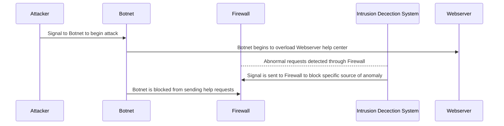

```mermaid
sequenceDiagram
  participant A as Attacker
  participant B as Botnet
  participant C as Firewall
  participant D as Intrusion Decection System
  participant E as Webserver

A->>B: Signal to Botnet to begin attack
B->>E: Botnet begins to overload Webserver help center
D-->C: Abnormal requests detected through Firewall
D->>C: Signal is sent to Firewall to block specific source of anomaly
B->>C: Botnet is blocked from sending help requests


```
