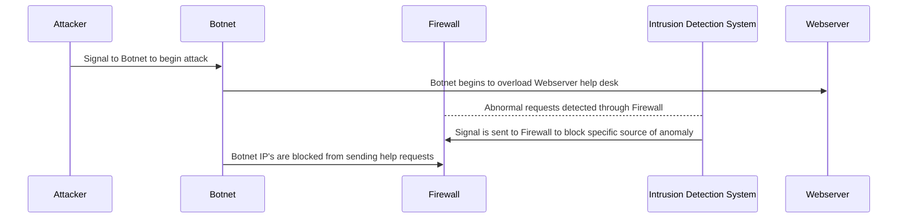

#### **Definitions**
_Attacker_ - Organizes medium of attack  
_Botnet_ - Utalized to carry out DDOS attack  
_Firewall_ - Blocks webserver traffic when necessary  
_Intrusion Detection System_ - Analyzes incoming webservertraffic, post firewall, scanning for abornmalities  
_Webserver_ - Centeral location of organization services. In this case the location of help desk  

#### **DDOS Attack Diagram**
!(https://www.mermaidchart.com/raw/d4432afc-d276-4e20-9e24-5acbd5a1eb9b?theme=light&version=v0.1&format=svg)

#### **Description of Attack Sequence**
1. Attacker signals to Botnet to begin attack 
2. Botnet begins to overload help center with requests slowing traffic for all users
3. IDS passivly analyzes traffic that makes it through firewall
4. IDS detects abnormal traffic and sends signal to firewall to block it
5. Botnet IP's are blocked from acessing webserver help desk
